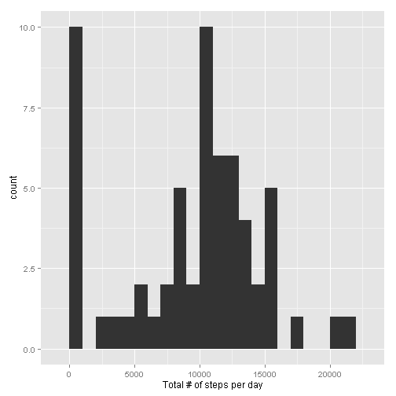

## Reproducible Research: Peer Assessment 1
###Neha Jain

### Loading and preprocessing the data

```r
data <- read.csv ("activity.csv")
```

###What is the mean total number of steps taken per day?

```r
library(ggplot2)
tot.steps<- tapply(data$steps, data$date, FUN=sum, na.rm=TRUE)
qplot(tot.steps, binwidth=1000, xlab= "Total # of steps per day")
```

 

```r
mean(tot.steps, na.rm=TRUE)
```

```
## [1] 9354
```

```r
median(tot.steps, na.rm=TRUE)
```

```
## [1] 10395
```

###What is the average daily activity pattern?

```r
avgs <- aggregate(x=list(steps=data$steps), by=list(interval=data$interval), FUN=mean, na.rm=TRUE)
ggplot(data=avgs, aes(x=interval, y=steps)) +  geom_line() + xlab("5-min interval")+ ylab("Avg steps")
```

 

```r
avgs[which.max(avgs$steps),]
```

```
##     interval steps
## 104      835 206.2
```

###Imputing missing values

```r
missing<- is.na(data$steps)
table (missing)
```

```
## missing
## FALSE  TRUE 
## 15264  2304
```

```r
fill.value <- function (steps, interval) {
  filled <- NA
	if (!is.na(steps))
		filled<- c(steps)
	else
		filled<- (avgs[avgs$interval==interval, "steps"])
	return(filled)
}
filled.data<- data
filled.data$steps <- mapply(fill.value, filled.data$steps, filled.data$interval)
tot.steps <- tapply(filled.data$steps, filled.data$date, FUN=sum)
qplot(tot.steps, binwidth=1000, xlab= "Total # of steps per day")
```

 

```r
mean(tot.steps)
```

```
## [1] 10766
```

```r
median(tot.steps)
```

```
## [1] 10766
```

## Are there differences in activity patterns between weekdays and weekends?

```r
weekday <- function(date) {
	day<- weekdays(date)
	if (day %in% c("Monday", "Tuesday","Wednesday","Thursday","Friday"))
		return("Weekday")
	else if (day %in% c("Saturday","Sunday"))
		return("Weekend")
	else
		stop("Invalid Date")
}
filled.data$date<- as.Date(filled.data$date)
filled.data$day <- sapply(filled.data$date, FUN=weekday)
averages <- aggregate(steps ~ interval + day, data= filled.data, mean)
ggplot(data=averages, aes(interval, steps)) +  geom_line() +facet_grid(day ~ . ) + xlab("5-min interval")+ ylab("Avg steps")
```

 
